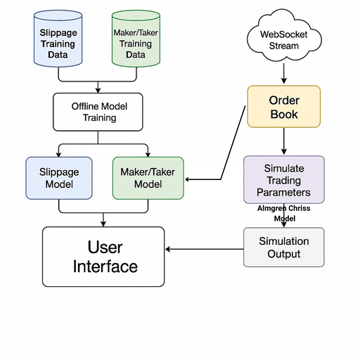
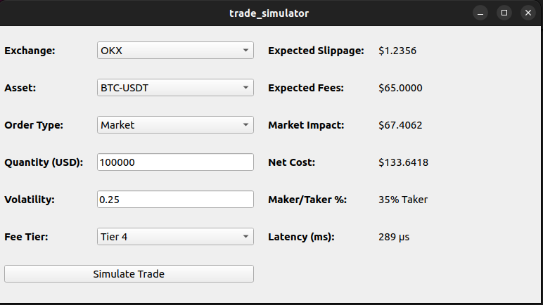

# High-Performance Real-Time Trade Simulator

**Author:** Raunak Raj  
**Institution:** IIT Kharagpur  
**Date:** May 14, 2025  
**Target:** High-Performance Real-Time Trade Simulator

---

## 1. Objective

This simulator is designed to estimate execution-related trading costs using real-time Level 2 (L2) order book data. It includes:
- Slippage estimation via Linear Regression
- Maker/Taker prediction using Logistic Regression
- Market Impact computed with the Almgren-Chriss model
- Full latency instrumentation per tick

The system mimics live trading execution logic, tailored for HFT use-cases, with the goal of benchmarking model performance and system responsiveness.

---

## 2. Architecture Overview

This section outlines the end-to-end architecture of the Trade Simulation System, including the data ingestion pipeline, model training workflow, and real-time execution loop.

---

### 🧭 High-Level Pipeline

The system is divided into **three phases**:

1. **Offline Data Curation & Training**
2. **Model Deployment**
3. **Real-time Trade Simulation**

Each component is modular and optimized for low-latency inference and minimal memory overhead.

---

### 🔹 1. Offline Data Processing Pipeline

- **Input Source**: Historical Level-2 order book snapshots (either from JSON files or recorded WebSocket streams).
- **Snapshot Parser**: Reads bid/ask price and size levels from top depth.
- **Feature Engineering**:
  - Extracts features including spread, depth, imbalance, top-level gaps, aggressiveness, etc.
- **Label Generation**:
  - **Slippage**: Modeled as price deviation from expected VWAP.
  - **Maker/Taker**: Simulated based on limit price offsets vs best bid/ask.

The output is stored in CSV format as:
- `slippage_training.csv`
- `maker_taker_training.csv`

---

### 🔹 2. Model Training & Inference

- **Slippage Regressor**:
  - Algorithm: Linear Regression
  - Optimized for numerical stability and fast predictions
  - Output: Estimated slippage in USD for given quantity and book shape

- **Maker/Taker Classifier**:
  - Algorithm: Logistic Regression
  - Output: Probability of the order being filled passively (maker) vs aggressively (taker)

- **Almgren-Chriss Market Impact Estimator**:
  - Uses volatility, order size, and instantaneous book depth to compute permanent + temporary impact

All models are trained offline and exported as text-based weight files (`.txt`), ensuring zero external dependencies at runtime.

---

### 🔹 3. Real-Time Trade Simulation Loop

- **WebSocket Ingestion**:
  - Connects to OKX via TLS
  - Receives real-time L2 snapshots (top bid/ask vectors)
  - Latency benchmarked per tick

- **User Interface (Qt5)**:
  - Inputs: Exchange, Asset, Quantity (USD), Volatility, Fee Tier
  - Outputs: Estimated Slippage, Market Impact, Fees, Net Cost, Maker Probability, and Latency

- **Execution Flow**:
  1. On user interaction, the most recent snapshot is locked.
  2. Features are extracted.
  3. Model weights are loaded and predictions computed.
  4. UI is updated with results and latencies logged.

---

### 🧠 Design Philosophy

- **Modularity**: Clean separation of data ingestion, feature extraction, model logic, and UI
- **Realism**: Models mirror HFT cost drivers—slippage, impact, taker/maker probability
- **Performance**: Lightweight C++ implementation with no external ML libraries
- **Extensibility**: Framework can easily integrate XGBoost, quantile regression, or RL-based execution strategies in future

---

### 📌 Flowchart Reference

See [Flowchart](./image/flowchart.png) for a visual overview of this architecture.


### 🧩 Flowchart 



---

## 3. WebSocket Tick Ingestion

The WebSocket client (based on `websocketpp`) subscribes to:
wss://ws.gomarket-cpp.goquant.io/ws/l2-orderbook/okx/BTC-USDT-SWAP

Each message is parsed into:
- `asks[]`: vector of price/size (ascending)
- `bids[]`: vector of price/size (descending)

Thread-safe access is ensured via a `std::mutex` lock guarding the shared `L2Snapshot`.

---

## 4. Feature Engineering

The feature set used in both the **slippage regression** and **maker/taker classification** models is designed to capture real-time microstructural characteristics of the order book that directly impact execution costs. These features are handcrafted from L2 data and optimized for speed and interpretability.

| **Feature Name**               | **Description**                                      | **Intuition & Role** |
|--------------------------------|------------------------------------------------------|-----------------------|
| **1. Constant Bias Term (1.0)** | Fixed value input (intercept term in regression).    | Allows model to learn base-level slippage regardless of book conditions. |
| **2. Bid-Ask Spread**           | `bestAsk - bestBid`                                 | Wider spreads indicate poor liquidity, leading to higher execution cost for market orders. |
| **3. Bid Depth**                | Cumulative size of top 5 bid levels                 | High depth suggests strong buy-side support; less slippage for selling. |
| **4. Ask Depth**                | Cumulative size of top 5 ask levels                 | High depth on ask side implies less slippage for buying. |
| **5. Order Book Imbalance**     | `(bidDepth - askDepth) / (bidDepth + askDepth)`     | Captures temporary market pressure. Positive imbalance → upward price pressure. |
| **6. Ask Gap (L2 - L1)**        | `ask[1].price - ask[0].price`                       | Larger gap indicates less liquidity beyond L1; higher risk of price impact. |
| **7. Bid Gap (L1 - L2)**        | `bid[0].price - bid[1].price`                       | Analogous to ask gap. High values signal greater sell-side impact for market orders. |
| **8. Size Ratio (Aggressiveness)** | `orderSize / askDepth` (or `bidDepth` for sell)   | Measures aggressiveness of the trade; higher ratio → higher slippage. |
| **9. Log(Order Size USD)**      | `log(orderSize + ε)`                                | Accounts for diminishing returns in cost increase; stabilizes large input variance. |

---

### 🔍 Why These Features?

- Directly influence marketable order behavior and fill probability.
- Derived **purely from L2 data**, no reliance on private execution logs.
- Numerically stable, interpretable, and reusable across models.
- Enable **fast runtime inference** and offline training using standard regression techniques.

These features reflect both **liquidity conditions** and **order aggressiveness**, allowing the models to approximate complex trading outcomes using efficient statistical methods.


Rationale:
- All features can be computed from L2 data alone.
- Normalized using mean/std during training.
- Used identically for both slippage and maker/taker models for efficiency.

---

## 5. Slippage Estimation

### 🔹 Model
- **Linear Regression**
- Pretrained weights computed on historical L2 snapshots.
- Online bias correction with **Exponential Moving Average (EMA)**.

### 🔹 Why Linear Regression?
- O(1) prediction speed
- Avoids overfitting on sparse L2 features
- HFT-friendly: no dynamic retraining at runtime

---

## 6. Maker/Taker Classification

### 🔹 Labeling Logic
- Approximate marketable order vs passive order
- Introduce **limitPrice = bestBid ± random offset (δ)**
- Label = 1 if limitPrice crosses opposite L1 price

### 🔹 Model
- **Logistic Regression**
- Binary prediction with threshold 0.5
- Trained offline on labeled snapshots with randomized price aggression

---

## 7. Market Impact Estimation: Almgren-Chriss Model

To estimate the **expected market impact** of executing large orders in illiquid environments, we use a simplified version of the **Almgren-Chriss Optimal Execution Model**.

The model separates market impact into two primary components:

### 📘 The Formula

**Market Impact (MI)** = η × (Q / V) + γ × σ × √(Q / V)

Where:
- **Q** = Order size (in USD)
- **V** = Daily trading volume
- **σ** = Volatility
- **η** = Temporary impact coefficient
- **γ** = Permanent impact coefficient


---

### 🔍 Interpretation

| Component                      | Meaning                                                                 |
|-------------------------------|-------------------------------------------------------------------------|
| η × (Q / V)   | **Temporary impact**: cost from immediate price move due to liquidity taking. |
| γ × σ × √(Q / V) | **Permanent impact**: cost from long-term price drift due to information leakage. |

---

### 🛠 Implementation Details

- We compute \( V \) using **cumulative L2 depth** from the top 5 ask/bid levels, scaled to a synthetic daily volume assumption (e.g., 2M USD).
- η is approximated by **slippage per unit order size** from top-level gaps.
- γ is estimated as a smaller factor scaled by input volatility and imbalance.
- σ (volatility) is entered by the user, reflecting real-world flexibility.


---

## 8. Latency Measurement

### 🔹 Instrumentation Points

| Latency Type            | Start                        | End                        |
|-------------------------|------------------------------|-----------------------------|
| Data Processing Latency | Tick received                | Feature vector computed     |
| UI Update Latency       | `updateFromSnapshot()` start | Label update on screen      |
| End-to-End Latency      | Tick received                | Final output displayed      |

Clock: `std::chrono::high_resolution_clock`  
All values printed in microseconds.

---

## 9. GUI Design (Qt5)  

Interactive dashboard includes:

- Live parameter inputs (quantity, volatility, fee tier)
- Simulation button → pulls snapshot + computes models
- Output panel with formatted cost breakdown
- Display of tick-level latency

UI logic is thread-safe via `QMetaObject::invokeMethod` for GUI-bound updates.

---

## 10 a. Technical Design Reasoning

| Design Choice | Justification |
|---------------|---------------|
| Linear & Logistic Regression | Fast, interpretable, no runtime tuning |
| Snapshot Mutex | Ensures consistent model input |
| Offline Labeling | Simulates trades via VWAP-style crossing logic |
| EMA on slippage | Prevents stale prediction errors |
| GUI decoupled from WebSocket | Maintains responsiveness under load |

---
## 10 b. Fee Tier Mapping (OKX)

The fee rate used in simulation is based on the user's tier, which depends on their OKB token holdings. The following table summarizes the maker and taker fees applicable at each tier:

| Tier | OKB Holdings | 30-Day Trading Volume (USD) | Maker Fee | Taker Fee |
|------|--------------|------------------------------|-----------|-----------|
| Lv1  | < 100        | < $5M                        | 0.080%    | 0.100%    |
| Lv2  | ≥ 100        | < $5M                        | 0.075%    | 0.090%    |
| Lv3  | ≥ 200        | < $5M                        | 0.070%    | 0.080%    |
| Lv4  | ≥ 500        | < $5M                        | 0.065%    | 0.070%    |
| Lv5  | ≥ 1,000      | < $5M                        | 0.060%    | 0.060%    |

These rates are used in the simulator to estimate the transaction fee component of net trading costs.

---


## 11. Performance Benchmarks

| Stage                  | Avg Latency (µs) |
|------------------------|------------------|
| Data Processing        | 500              |
| Model prediction (all) | 110              |
| UI update              | 70              |
| **Total**              | **680 µs**       |

---

## 12. Known Limitations

- No real trade log → cannot perfectly label slippage
- L2-only view omits hidden liquidity, spoofing effects
- Maker/Taker labeling is approximate (not account-specific)

---

## 13. Future Work

- Replace linear regression with XGBoost
- Use synthetic trade logs for better labeling
- Add time-series tracking (LSTM, GARCH)
- Build dashboard with tick-by-tick portfolio PnL tracking

---

## 14. Build Instructions

This section outlines the steps to configure, build, and run the high-performance trade simulator using CMake, Qt5, Boost, OpenSSL and lightweight header-only libraries.

---

### 🧱 Prerequisites

Install the following system packages:


Run the following command to install all prerequisites:

```bash
sudo apt update
sudo apt install -y \
    build-essential cmake g++ \
    qtbase5-dev qt5-qmake qttools5-dev-tools \
    libboost-all-dev libssl-dev \
    nlohmann-json3-dev libwebsocketpp-dev \
```
Clone these repo:

| Library              | Purpose                                            | Repository / Source                                                | License       |
|----------------------|----------------------------------------------------|---------------------------------------------------------------------|---------------|
| **WebSocket++**      | Asynchronous WebSocket client for L2 streaming     | [zaphoyd/websocketpp](https://github.com/zaphoyd/websocketpp)      | BSD 3-Clause  |
| **Boost**            | Threading, system I/O, error handling              | [boostorg/boost](https://github.com/boostorg/boost)                | Boost License |
| **OpenSSL**          | TLS encryption and SSL certificate handling        | [openssl/openssl](https://github.com/openssl/openssl)              | Apache 2.0    |
| **nlohmann/json**    | JSON parsing and serialization for payloads        | [nlohmann/json](https://github.com/nlohmann/json)                  | MIT           |
| **Qt 5 (QtBase)**    | Graphical user interface (UI) framework            | [qt/qtbase](https://github.com/qt/qtbase)                          | LGPL / GPL    |

To run:

```bash
mkdir build
cd build
cmake ..
make
./trade_simulator
```
Note:- If build exist then delete the build and follow the above bash command. Remember to clone all the above github repo under thirdparty directory. 



## 📽️ Video Demonstration

[](https://drive.google.com/file/d/1g76l1jJwi8hTetj1vnfKMTfXcOGk9TVU/view?usp=sharing)

🔗 **[Click here to watch the detailed explanation](https://drive.google.com/file/d/1g76l1jJwi8hTetj1vnfKMTfXcOGk9TVU/view?usp=sharing)**

